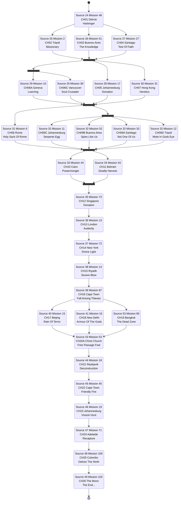
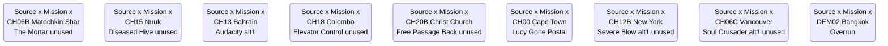

## Missions diagram of the Church campaign.

```mermaid
stateDiagram-v2
    mission2: Source 25 Mission 2<br/>CH02 Tripoli<br/>Missionary
    mission6: Source 31 Mission 6<br/>CH08 Rome<br/>Holy Sack Of Rome
    mission10: Source 29 Mission 10<br/>CH06A Geneva<br/>Learning
    mission11: Source 32 Mission 11<br/>CH09C Johannesburg<br/>Serpents Egg
    mission12: Source 32 Mission 12<br/>CH09D Tripoli<br/>Mote In Gods Eye
    mission13: Source 36 Mission 13<br/>CH13 London<br/>Audacity
    mission14: Source 38 Mission 14<br/>CH15 Riyadh<br/>Severe Blow
    mission15: Source 40 Mission 15<br/>CH17 Beijing<br/>Rain Of Terror
    mission16: Source 41 Mission 16<br/>CH18 New Delhi<br/>Armour Of The Gods
    mission17: Source 28 Mission 17<br/>CH05 Johannesburg<br/>Donation
    mission18: Source 44 Mission 18<br/>CH21 Reykjavik<br/>Deconstruction
    mission19: Source 46 Mission 19<br/>CH23 Johannesburg<br/>Vissick Hunt
    mission27: Source 27 Mission 27<br/>CH04 Santiago<br/>Test Of Faith
    mission31: Source 30 Mission 31<br/>CH07 Hong Kong<br/>Heretics
    mission33: Source 32 Mission 33<br/>CH09A Santiago<br/>Not One Of Us
    mission39: Source 29 Mission 39<br/>CH06C Vancouver<br/>Soul Crusader
    mission43: Source 34 Mission 43<br/>CH11 Bahrain<br/>Deadly Harvest
    mission44: Source 33 Mission 44<br/>CH10 Cairo<br/>Powermonger
    mission45: Source 45 Mission 45<br/>CH22 Cape Town<br/>Friendly Fire
    mission48: Source 24 Mission 48<br/>CH01 Detroit<br/>Harbinger
    mission51: Source 26 Mission 51<br/>CH03 Buenos Aires<br/>The Knowledge
    mission52: Source 32 Mission 52<br/>CH09B Buenos Aires<br/>Spies Like Us
    mission53: Source 43 Mission 53<br/>CH20A Christ Church<br/>Free Passage Fwd
    mission71: Source 47 Mission 71<br/>CH24 Adelaide<br/>Recapture
    mission72: Source 37 Mission 72<br/>CH14 New York<br/>Divine Light
    mission73: Source 35 Mission 73<br/>CH12 Singapore<br/>Donation
    mission85: Source 53 Mission 85<br/>CH19 Bangkok<br/>The Dead Zone
    mission87: Source 39 Mission 87<br/>CH16 Cape Town<br/>Fall Among Thieves
    mission100: Source 48 Mission 100<br/>CH25 Colombo<br/>Deliver The Ninth
    mission102: Source 49 Mission 102<br/>CH26 The Moon<br/>The End...
    state fork17 <<fork>>
    state fork10 <<fork>>
    state fork6 <<fork>>
    state fork11 <<fork>>
    state fork44 <<fork>>
    state join44 <<join>>
    [*] --> mission48
    mission2 --> fork17
    fork6 --> mission6
    fork6 --> fork11
    mission6 --> fork44
    fork10 --> mission10
    fork10 --> mission39
    mission10 --> fork6
    fork11 --> mission11
    fork11 --> mission52
    fork11 --> mission33
    fork11 --> mission12
    mission11 --> fork44
    mission12 --> fork44
    mission13 --> mission72
    mission14 --> mission87
    mission15 --> mission53
    mission16 --> mission53
    fork17 --> fork10
    fork17 --> mission17
    fork17 --> mission31
    mission17 --> fork6
    mission18 --> mission45
    mission19 --> mission71
    mission27 --> fork17
    mission31 --> fork6
    mission33 --> fork44
    mission39 --> fork6
    mission43 --> join44
    fork44 --> mission44
    fork44 --> mission43
    mission44 --> join44
    join44 --> mission73
    mission45 --> mission19
    mission48 --> mission2
    mission48 --> mission51
    mission48 --> mission27
    mission51 --> fork17
    mission52 --> fork44
    mission53 --> mission18
    mission71 --> mission100
    mission72 --> mission14
    mission73 --> mission13
    mission85 --> mission53
    mission87 --> mission15
    mission87 --> mission16
    mission87 --> mission85
    mission100 --> mission102
    mission102 --> [*]
```

## Interesting unused missions of the Church campaign.

```mermaid
stateDiagram-v2
    mission30: Source x Mission x<br/>CH06B Matochkin Shar<br/>The Mortar unused
    mission32: Source x Mission x<br/>CH15 Nuuk<br/>Diseased Hive unused
    mission40: Source x Mission x<br/>CH13 Bahrain<br/>Audacity alt1
    mission47: Source x Mission x<br/>CH18 Colombo<br/>Elevator Control unused
    mission54: Source x Mission x<br/>CH20B Christ Church<br/>Free Passage Back unused
    mission79: Source x Mission x<br/>CH00 Cape Town<br/>Lucy Gone Postal
    mission86: Source x Mission x<br/>CH12B New York<br/>Severe Blow alt1 unused
    mission98: Source x Mission x<br/>CH06C Vancouver<br/>Soul Crusader alt1 unused
    mission108: Source x Mission x<br/>DEM02 Bangkok<br/>Overrun
```

## Early/unfinished/test missions of the Church campaign.

```mermaid
stateDiagram-v2
    none
```
