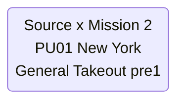

## Missions diagram of the Punk campaign

```mermaid
stateDiagram-v2
    mission1: Source x Mission 1<br/>PU01 New York<br/>General Takeout
    mission3: Source x Mission 3<br/>PU00 Tokyo<br/>Need Some Prep
    mission60: Source x Mission 60<br/>PU03 Riyadh<br/>Guns Guns Guns alt1
    mission61: Source x Mission 61<br/>PU04 Cut52<br/>Get The Power
    mission62: Source x Mission 62<br/>PU08 Rome<br/>Rescue
    mission64: Source x Mission 63<br/>PU03 Bangkok<br/>Serve And Shoot
    mission65: Source x Mission 65<br/>PU14A Honolulu<br/>Massive Assault
    mission66: Source x Mission 66<br/>PU06 Capetown<br/>Unpurged
    mission67: Source x Mission 67<br/>PU16 Buenos Aires<br/>Talks Ambush
    mission68: Source x Mission 68<br/>PU02 Detroit<br/>Zealot Attack
    mission69: Source x Mission 69<br/>PU19 Christ Church<br/>Trash Church
    mission70: Source x Mission 70<br/>PU05 Hong Kong<br/>Reach The Art
    mission75: Source x Mission 75<br/>PU15c London<br/>Ferocity
    mission77: Source x Mission 77<br/>PU03 Riyadh<br/>Guns Guns Guns
    mission78: Source x Mission 78<br/>PU04 Anchorage V1<br/>Communications
    mission80: Source x Mission 80<br/>PU02 Detroit<br/>Clean-Up
    mission81: Source x Mission 81<br/>PU07 Singapore<br/>Godfather
    mission82: Source x Mission 82<br/>PU09 Matochkin Shar<br/>Dumped
    mission103: Source x Mission 103<br/>PU00 Anchorage V2<br/>Tale Of Two Cities
    state fork77 <<fork>>
    state join77 <<join>>
    state fork78 <<fork>>
    state join78 <<join>>
    [*] --> mission68
    mission1 --> fork78
    mission3 --> mission1
    mission60 --> join77
    mission61 --> join78
    mission62 --> mission82
    mission64 --> mission3
    mission65 --> mission75
    mission66 --> mission81
    mission67 --> mission69
    mission68 --> mission80
    mission69 --> mission103
    mission70 --> mission66
    mission75 --> mission67
    fork77 --> mission77
    fork77 --> mission60
    mission77 --> join77
    join77 --> mission64
    fork78 --> mission78
    fork78 --> mission61
    mission78 --> join78
    join78 --> mission70
    mission80 --> fork77
    mission81 --> mission62
    mission82 --> mission65
    mission103 --> [*]
```

## Interesting unused missions of the Punk campaign

```mermaid
stateDiagram-v2
    none
```

## Early/unfinished/test missions of the Punk campaign

```mermaid
stateDiagram-v2
    mission2: Source x Mission 2<br/>PU01 New York<br/>General Takeout pre1
```
