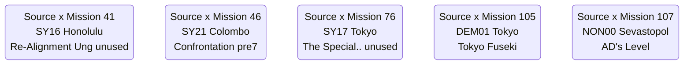
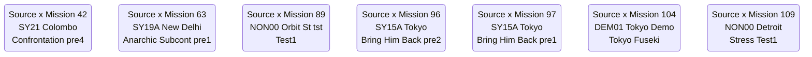

## Missions diagram of the Eurocorp campaign

```mermaid
stateDiagram-v2
    mission1: Source 1 Mission 1<br/>SY01 London<br/>Executive Alert
    mission3: Source 3 Mission 3<br/>SY03A Beijing<br/>Friendly Persuasion
    mission4: Source 4 Mission 4<br/>SY04A Geneva<br/>Knowledge
    mission5: Source 7 Mission 5<br/>SY07 Rome<br/>Corp Sack Of Rome
    mission7: Source 13 Mission 7<br/>SY13A Reykjavik<br/>Out Of This World
    mission8: Source 14 Mission 8<br/>SY14 London<br/>Duplicity
    mission9: Source 17 Mission 9<br/>SY17 Johannesburg<br/>Special Agent
    mission20: Source 19 Mission 20<br/>SY19A New Delhi<br/>Anarchic Subcont
    mission21: Source 6 Mission 21<br/>SY06 Phoenix<br/>Phoenix In Flames
    mission22: Source 3 Mission 22<br/>SY03B Hong Kong<br/>Fusion
    mission23: Source 15 Mission 23<br/>SY15B Bangkok<br/>Bring Him Back Alive
    mission24: Source 19 Mission 24<br/>SY19B Sevastopol<br/>Edge Of Darkness
    mission25: Source 11 Mission 25<br/>SY11A Adelaide<br/>Walkabout
    mission26: Source 11 Mission 26<br/>SY11B Santiago<br/>Forbidden Knowledge
    mission28: Source 13 Mission 28<br/>SY13B Nuuk<br/>The Hive
    mission29: Source 4 Mission 29<br/>SY04B Matochkin Shar<br/>Lost Minds
    mission34: Source 5 Mission 34<br/>SY05 Singapore<br/>Open Re-Bullion
    mission35: Source 10 Mission 35<br/>SY10 New York<br/>Taken To Taks
    mission36: Source 15 Mission 36<br/>SY15A Tokyo<br/>Bring Him Back
    mission37: Source 4 Mission 37<br/>SY04C Vancouver<br/>Guru
    mission38: Source 11 Mission 38<br/>SY11C Cape Town<br/>Science Major
    mission49: Source 2 Mission 49<br/>SY02 Detroit<br/>The Unguided
    mission50: Source 11 Mission 50<br/>SY11D Buenos Aires<br/>Trail Of Prophet
    mission55: Source 8 Mission 55<br/>SY08A Hong Kong<br/>Body Matters
    mission56: Source 8 Mission 56<br/>SY08B Phoenix<br/>Interloper
    mission57: Source 9 Mission 57<br/>SY09 Rome<br/>Head Hunt
    mission58: Source 8 Mission 58<br/>SY08C Beijing<br/>Semi-Automatic
    mission59: Source 12 Mission 59<br/>SY12 Christ Church<br/>Word Of God
    mission74: Source 16 Mission 74<br/>SY16 Honolulu<br/>Re-Alignment
    mission83: Source 18 Mission 83<br/>SY18 Cairo<br/>Slowdive
    mission84: Source 21 Mission 84<br/>SY21 Colombo<br/>Confrontation
    mission88: Source 21 Mission 88<br/>SY22 Orbit St<br/>Shuttle Diplomacy
    mission92: Source 20 Mission 92<br/>SY20 Bahrain<br/>Arab Agenda
    mission101: Source 21 Mission 101<br/>SY23 The Moon<br/>Church Of Poisoned Mind
    state fork22 <<fork>>
    state join22 <<fork>>
    state fork4 <<fork>>
    state join4 <<join>>
    state fork55 <<fork>>
    state fork26 <<fork>>
    state join26 <<join>>
    state fork7 <<fork>>
    state fork36 <<fork>>
    state fork20 <<fork>>
    [*] --> mission1
    mission1 --> mission49
    mission3 --> join22
    fork4 --> mission4
    fork4 --> mission37
    fork4 --> mission29
    mission4 --> join4
    mission5 --> fork55
    fork7 --> mission7
    fork7 --> mission28
    mission7 --> mission8
    mission8 --> fork36
    mission9 --> mission83
    fork20 --> mission20
    fork20 --> mission24
    mission20 --> mission92
    mission21 --> fork55
    mission22 --> join22
    join22 --> mission34
    join22 --> fork4
    mission23 --> mission74
    mission24 --> mission92
    mission25 --> join26
    fork26 --> mission26
    fork26 --> mission50
    fork26 --> mission38
    fork26 --> mission25
    mission26 --> join26
    mission28 --> mission8
    mission29 --> join4
    mission34 --> mission21
    mission34 --> mission5
    mission35 --> fork26
    mission35 --> mission59
    fork36 --> mission36
    fork36 --> mission23
    mission36 --> mission74
    mission37 --> join4
    mission38 --> join26
    mission49 --> fork22
    mission50 --> join26
    fork22 --> mission22
    fork22 --> mission3
    fork55 --> mission55
    fork55 --> mission58
    fork55 --> mission56
    mission55 --> mission57
    mission56 --> mission57
    mission57 --> mission35
    mission58 --> mission57
    mission59 --> fork7
    mission74 --> mission9
    mission83 --> fork20
    mission84 --> mission88
    mission88 --> mission101
    mission92 --> mission84
    mission101 --> [*]
    %% currently the notes affect placement of states too much
    %%note left of mission49 : Weapon introduction#58;<br/>High Explosive
    %%note left of mission34 : Weapon introduction#58;<br/>LR Rifle
    %%note left of mission21 : Weapon introduction#58;<br/>Electron Mace
    %%note left of mission5 : Weapon introduction#58;<br/>Cerberus IFF, Satelite Rain
    %%note left of mission35 : Weapon introduction#58;<br/>Clone Shield
    %%note left of mission38 : Weapon introduction#58;<br/>Launcher
    %%note left of mission59 : Weapon introduction#58;<br/>Nuclear Grenade
    %%note left of mission83 : Weapon introduction#58;<br/>Plasma Lance, Stasis Field, Trigger Wire
    %%note left of mission92 : Weapon introduction#58;<br/>Displacertron
    %%note left of mission101 : Weapon introduction#58;<br/>Graviton Gun
```

## Interesting unused missions of the Eurocorp campaign

```mermaid
stateDiagram-v2
    mission41: Source x Mission 41<br/>SY16 Honolulu<br/>Re-Alignment Ung unused
    mission46: Source x Mission 46<br/>SY21 Colombo<br/>Confrontation pre7
    mission76: Source x Mission 76<br/>SY17 Tokyo<br/>The Special.. unused
    mission105: Source x Mission 105<br/>DEM01 Tokyo<br/>Tokyo Fuseki
    mission107: Source x Mission 107<br/>NON00 Sevastopol<br/>AD's Level
```

## Early/unfinished/test missions of the Eurocorp campaign

```mermaid
stateDiagram-v2
    mission42: Source x Mission 42<br/>SY21 Colombo<br/>Confrontation pre4
    mission63: Source x Mission 63<br/>SY19A New Delhi<br/>Anarchic Subcont pre1
    mission89: Source x Mission 89<br/>NON00 Orbit St tst<br/>Test1
    mission96: Source x Mission 96<br/>SY15A Tokyo<br/>Bring Him Back pre2
    mission97: Source x Mission 97<br/>SY15A Tokyo<br/>Bring Him Back pre1
    mission104: Source x Mission 104<br/>DEM01 Tokyo Demo<br/>Tokyo Fuseki
    mission109: Source x Mission 109<br/>NON00 Detroit<br/>Stress Test1
```
